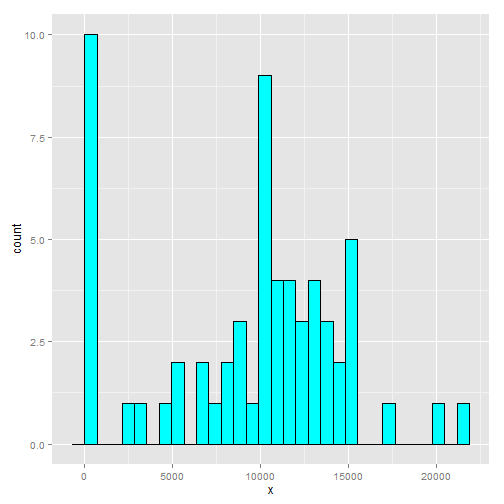
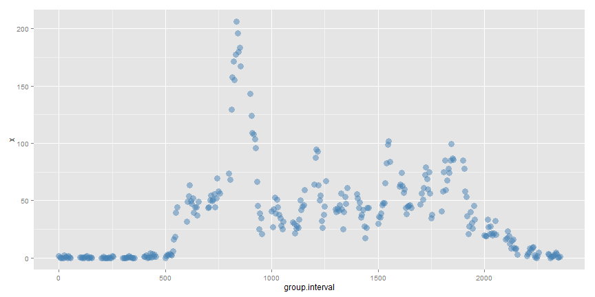
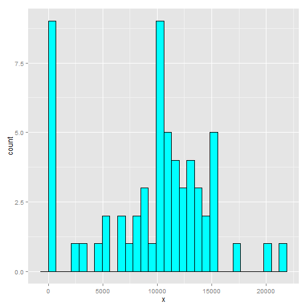
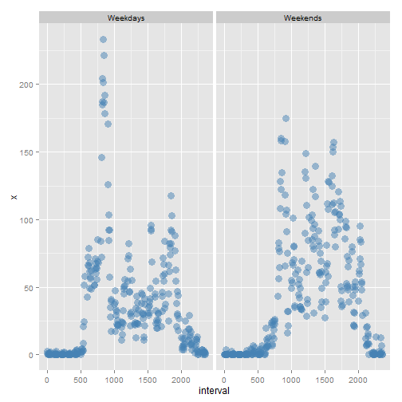

Title
========================================================

This assignment makes use of data from a personal activity monitoring device. This device collects data at 5 minute intervals through out the day. The data consists of two months of data from an anonymous individual collected during the months of October and November, 2012 and include the number of steps taken in 5 minute intervals each day.

Data
=======
The data for this assignment can be downloaded from the course web site:

  Dataset: Activity monitoring data (https://d396qusza40orc.cloudfront.net/repdata%2Fdata%2Factivity.zip) [52K]
  
  The variables included in this dataset are:
* steps: Number of steps taking in a 5-minute interval (missing values are coded as NA)
* date: The date on which the measurement was taken in YYYY-MM-DD format
* interval: Identifier for the 5-minute interval in which measurement was taken
  
Purpose
========

* Loading and preprocessing the data
* What is mean total number of steps taken per day?
* What is the average daily activity pattern?
* Imputing missing values
* Are there differences in activity patterns between weekdays and weekends?


Solution
========
## Please make sure you have these libraries installed.

```r
install.packages("ggplot")
install.packages("lattice")
install.packages("RCurl")
install.packages("dplyr")
```

 
## load the libraries

```r
library(ggplot2)
```

```
## Warning: package 'ggplot2' was built under R version 3.2.1
```

```r
library(lattice)
library(RCurl)
```

```
## Loading required package: bitops
```

```r
library(dplyr)
```

```
## 
## Attaching package: 'dplyr'
## 
## The following objects are masked from 'package:stats':
## 
##     filter, lag
## 
## The following objects are masked from 'package:base':
## 
##     intersect, setdiff, setequal, union
```

```r
library(grid)
```

## download the data file from the website.

```r
fileUrl <- "https://d396qusza40orc.cloudfront.net/repdata%2Fdata%2Factivity.zip"
download.file(fileUrl, destfile = "./activity.zip", method="libcurl")
unzip("./activity.zip")
```

## Loading and preprocessing the data
load the data file into a data.frame

```r
activityfilename <- "activity.csv"
activityrawdata <- read.csv(activityfilename, sep=",", header=TRUE, colClasses=c("numeric", "Date", "numeric"))
str(activityrawdata)
```

```
## 'data.frame':	17568 obs. of  3 variables:
##  $ steps   : num  NA NA NA NA NA NA NA NA NA NA ...
##  $ date    : Date, format: "2012-10-01" "2012-10-01" ...
##  $ interval: num  0 5 10 15 20 25 30 35 40 45 ...
```

```r
summary(activityrawdata)
```

```
##      steps             date               interval     
##  Min.   :  0.00   Min.   :2012-10-01   Min.   :   0.0  
##  1st Qu.:  0.00   1st Qu.:2012-10-16   1st Qu.: 588.8  
##  Median :  0.00   Median :2012-10-31   Median :1177.5  
##  Mean   : 37.38   Mean   :2012-10-31   Mean   :1177.5  
##  3rd Qu.: 12.00   3rd Qu.:2012-11-15   3rd Qu.:1766.2  
##  Max.   :806.00   Max.   :2012-11-30   Max.   :2355.0  
##  NA's   :2304
```

```r
head(activityrawdata)
```

```
##   steps       date interval
## 1    NA 2012-10-01        0
## 2    NA 2012-10-01        5
## 3    NA 2012-10-01       10
## 4    NA 2012-10-01       15
## 5    NA 2012-10-01       20
## 6    NA 2012-10-01       25
```
# Yey! We just loaded the datafile.

## What is mean total number of steps taken per day?
Now, process the raw data to summarize and plot


```r
stepsbydate <- aggregate(activityrawdata[,1], by=list(group.date=activityrawdata$date), FUN=sum, na.rm=TRUE)
head(stepsbydate)
```

```
##   group.date     x
## 1 2012-10-01     0
## 2 2012-10-02   126
## 3 2012-10-03 11352
## 4 2012-10-04 12116
## 5 2012-10-05 13294
## 6 2012-10-06 15420
```

```r
summary(stepsbydate)
```

```
##    group.date               x        
##  Min.   :2012-10-01   Min.   :    0  
##  1st Qu.:2012-10-16   1st Qu.: 6778  
##  Median :2012-10-31   Median :10395  
##  Mean   :2012-10-31   Mean   : 9354  
##  3rd Qu.:2012-11-15   3rd Qu.:12811  
##  Max.   :2012-11-30   Max.   :21194
```


### Total number of steps taken is:

```r
sum(stepsbydate[,2])
```

```
## [1] 570608
```

### histogram for number of steps by date is:

```r
#hist(stepsbydate[,2], xlab="no of steps", ylab="Frequency", 
#     main="Histogram of number of steps taken each day")

g1 <- ggplot(stepsbydate, aes(x=x)) + geom_histogram(color="black", fill="cyan")
g1
```

 

### the mean and median number of steps by date are:

```r
mean(stepsbydate[,2])
```

```
## [1] 9354.23
```

```r
median(stepsbydate[,2])
```

```
## [1] 10395
```

## What is the average daily activity pattern?
Avg daily activity pattern processing

```r
stepsbyinterval <- aggregate(activityrawdata[,1], by=list(group.interval=activityrawdata$interval), FUN=mean, na.rm=TRUE)
head(stepsbyinterval)
```

```
##   group.interval         x
## 1              0 1.7169811
## 2              5 0.3396226
## 3             10 0.1320755
## 4             15 0.1509434
## 5             20 0.0754717
## 6             25 2.0943396
```

```r
summary(stepsbyinterval)
```

```
##  group.interval         x          
##  Min.   :   0.0   Min.   :  0.000  
##  1st Qu.: 588.8   1st Qu.:  2.486  
##  Median :1177.5   Median : 34.113  
##  Mean   :1177.5   Mean   : 37.383  
##  3rd Qu.:1766.2   3rd Qu.: 52.835  
##  Max.   :2355.0   Max.   :206.170
```

### time serires plot of the 5 minute interval (on x-axis) and average number of steps taken averaged across all days (on y-axis)

```r
#plot(stepsbyinterval)
g2 <- ggplot(stepsbyinterval, aes(x=group.interval, y=x)) + geom_point(color="steelblue", size=4, alpha=1/2)
g2
```

 

### maximum number of steps in the 5 minute intervals avergaged across all days

```r
maxsteps <- max(stepsbyinterval[,2])
rowwithmaxval <- stepsbyinterval[stepsbyinterval$x == maxsteps,]
rowwithmaxval[,1]
```

```
## [1] 835
```


## Imputing missing values
### total number of rows with NAs

```r
activityimputeddata <- activityrawdata[is.na(activityrawdata$steps),]
nrow(activityimputeddata)
```

```
## [1] 2304
```

Imputing missing values by replacing with the mean number of steps for that time interval 

```r
activityimputeddata <- mutate(activityimputeddata, steps = stepsbyinterval[stepsbyinterval$group.interval == interval, 2])
activityimputeddata <- rbind(activityimputeddata, activityrawdata[!is.na(activityrawdata$steps),])
#nrow(activityimputeddata)
```

### histogram fo the total number of steps taken each day

```r
imputedstepsbydate <- aggregate(activityimputeddata[,1], by=list(date=activityimputeddata$date), FUN=sum, na.rm=TRUE)
str(imputedstepsbydate)
```

```
## 'data.frame':	61 obs. of  2 variables:
##  $ date: Date, format: "2012-10-01" "2012-10-02" ...
##  $ x   : num  10766 126 11352 12116 13294 ...
```

```r
#hist(imputedstepsbydate[,2], xlab="no of steps", ylab="Frequency", 
#     main="Histogram of number of steps taken each day with imputed data")
g3 <- ggplot(imputedstepsbydate, aes(x=x)) + geom_histogram(color="black", fill="cyan")
g3
```

 

### the mean and median number of steps by date for the imputed data are:

```r
mean(imputedstepsbydate[,2])
```

```
## [1] 9530.724
```

```r
median(imputedstepsbydate[,2])
```

```
## [1] 10439
```

### As shown above the means and medians of the imputed data differs from those of the non imputed ones.

### The mean and medians are more for the imputed data as compared to the non imputed ones.


## Are there differences in activity patterns between weekdays and weekends?
Now processing for activity patterns between weekdays and weekends

```r
weekdayfactor <- function(checkDate) {
  dayofweek <- weekdays(as.Date(checkDate))
  #print(checkDate)
  if ( dayofweek == "Saturday"  ) as.factor("Weekends")
  else if ( dayofweek == "Sunday" ) as.factor("Weekends")
  else as.factor("Weekdays")
  }

x1 <- data.frame(activityimputeddata$date)
activityimputeddataweekendflag <- mutate(activityimputeddata, weekendflag = apply(x1, 1, weekdayfactor))
#activityimputeddataweekendflag$weekendflag <- factor(activityimputeddataweekendflag$weekendflag, levels=c("weekdays", "weekends"))

head(activityimputeddataweekendflag)
```

```
##       steps       date interval weekendflag
## 1 1.7169811 2012-10-01        0    Weekdays
## 2 0.3396226 2012-10-01        5    Weekdays
## 3 0.1320755 2012-10-01       10    Weekdays
## 4 0.1509434 2012-10-01       15    Weekdays
## 5 0.0754717 2012-10-01       20    Weekdays
## 6 2.0943396 2012-10-01       25    Weekdays
```

```r
str(activityimputeddataweekendflag)
```

```
## 'data.frame':	17568 obs. of  4 variables:
##  $ steps      : num  1.717 0.3396 0.1321 0.1509 0.0755 ...
##  $ date       : Date, format: "2012-10-01" "2012-10-01" ...
##  $ interval   : num  0 5 10 15 20 25 30 35 40 45 ...
##  $ weekendflag: Factor w/ 2 levels "Weekdays","Weekends": 1 1 1 1 1 1 1 1 1 1 ...
```

```r
summary(activityimputeddataweekendflag)
```

```
##      steps             date               interval        weekendflag   
##  Min.   :  0.00   Min.   :2012-10-01   Min.   :   0.0   Weekdays:12960  
##  1st Qu.:  0.00   1st Qu.:2012-10-16   1st Qu.: 588.8   Weekends: 4608  
##  Median :  0.00   Median :2012-10-31   Median :1177.5                   
##  Mean   : 37.38   Mean   :2012-10-31   Mean   :1177.5                   
##  3rd Qu.: 15.00   3rd Qu.:2012-11-15   3rd Qu.:1766.2                   
##  Max.   :806.00   Max.   :2012-11-30   Max.   :2355.0                   
##  NA's   :2016
```

```r
imputedstepsbyintervalweekendflag <- aggregate(activityimputeddataweekendflag[,1], by=list(interval=activityimputeddataweekendflag$interval, weekendflag=activityimputeddataweekendflag$weekendflag), FUN=mean, na.rm=TRUE)
str(imputedstepsbyintervalweekendflag)
```

```
## 'data.frame':	576 obs. of  3 variables:
##  $ interval   : num  0 5 10 15 20 25 30 35 40 45 ...
##  $ weekendflag: Factor w/ 2 levels "Weekdays","Weekends": 1 1 1 1 1 1 1 1 1 1 ...
##  $ x          : num  2.318 0.458 0.178 0.204 0.102 ...
```

```r
g6 <- ggplot(imputedstepsbyintervalweekendflag, aes(x=interval, y=x)) + 
      geom_point(color="steelblue", size=4, alpha=1/2) +facet_grid(. ~ weekendflag)
g6
```

 

## congratulations you just survived my marathon assignment. Now you can survive anywhere on Earth! 

